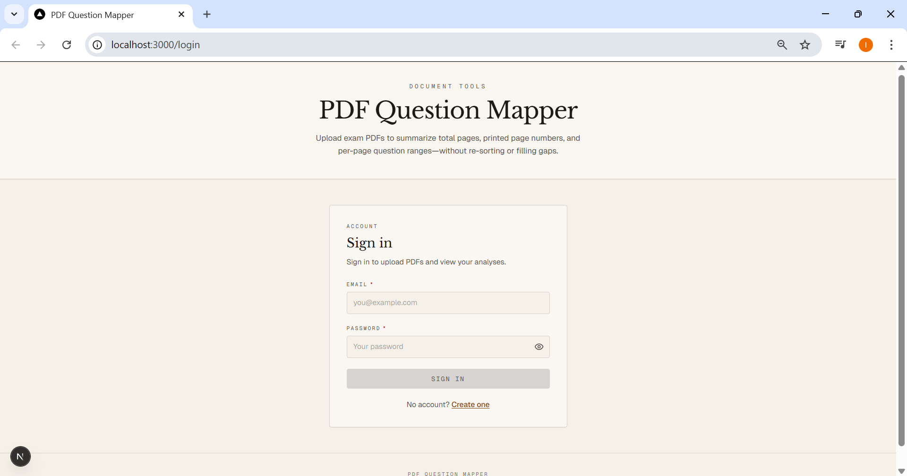
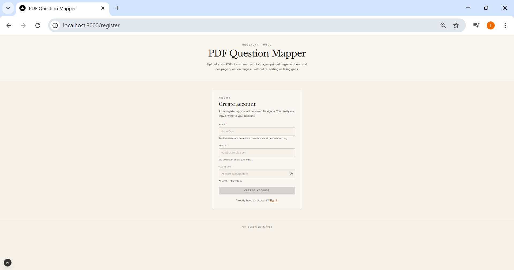
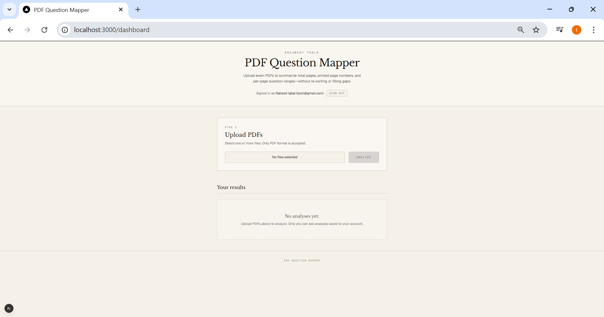
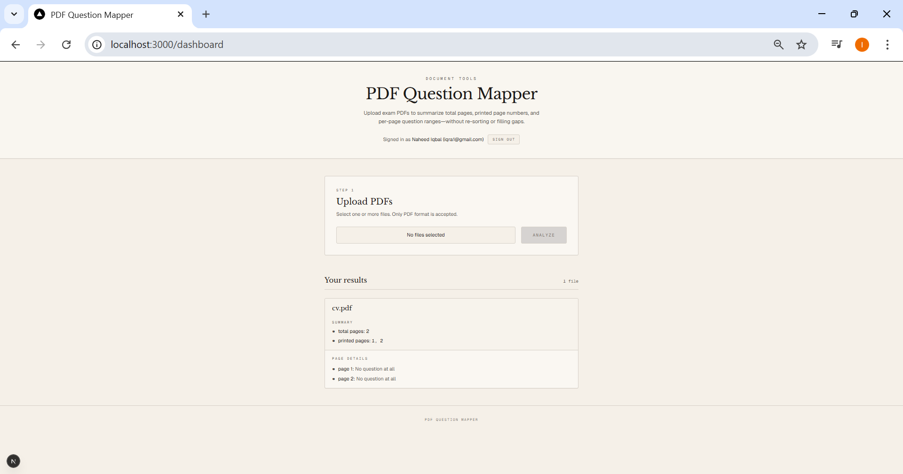

# PDF Question Mapper

A web app for uploading exam PDFs and viewing a structured summary: page count, printed page numbers in order, and question ranges per printed page. Accounts are required so analyses stay private.

## Screenshots

| Login | Register |
| :---: | :---: |
|  |  |

| Dashboard | Results |
| :---: | :---: |
|  |  |

## Stack

- **Next.js** (App Router), **React**, **TypeScript**
- **MongoDB** (Mongoose) for users and stored results
- **JWT** bearer tokens for API authentication
- **pdf-parse** (and related logic in `app/lib/pdfParser.ts`) for PDF analysis

## Features

- Register and sign in
- Upload one or more PDFs; results are returned from `POST /api/analyze-pdf` and saved per user
- Dashboard lists past analyses from `GET /api/results`

## Prerequisites

- Node.js 20+ (or current LTS)
- A MongoDB connection string

## Environment

Create `.env.local` in the project root:

```env
MONGO_URI=mongodb+srv://...   # or mongodb://... for local MongoDB
JWT_SECRET=your-long-random-secret
```

`JWT_SECRET` must be set for login and protected routes to work.

## Scripts

```bash
npm install
npm run dev      # development — http://localhost:3000
npm run build    # production build
npm run start    # run production server (after build)
```

## Project layout (high level)

- `app/(auth)/` — login and register pages and shared layout
- `app/images/` — README screenshots (login, register, dashboard, results)
- `app/dashboard/` — upload UI and saved results
- `app/api/` — auth, analyze, and results routes
- `app/lib/` — database, auth helpers, PDF parsing
